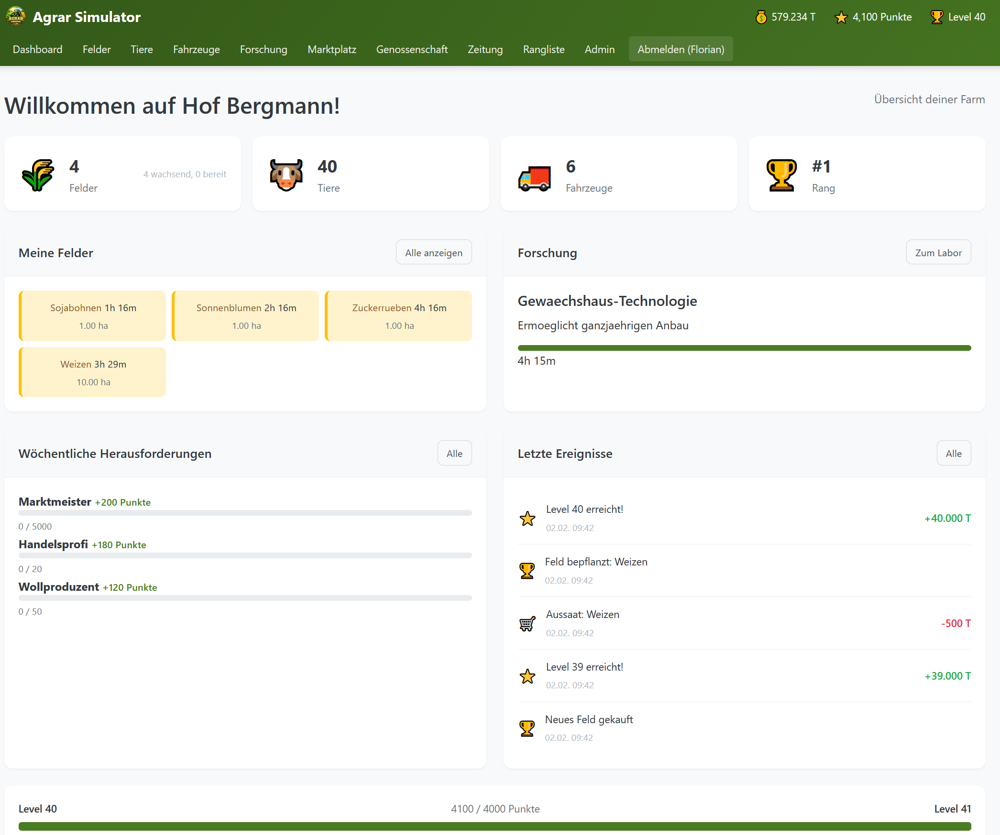
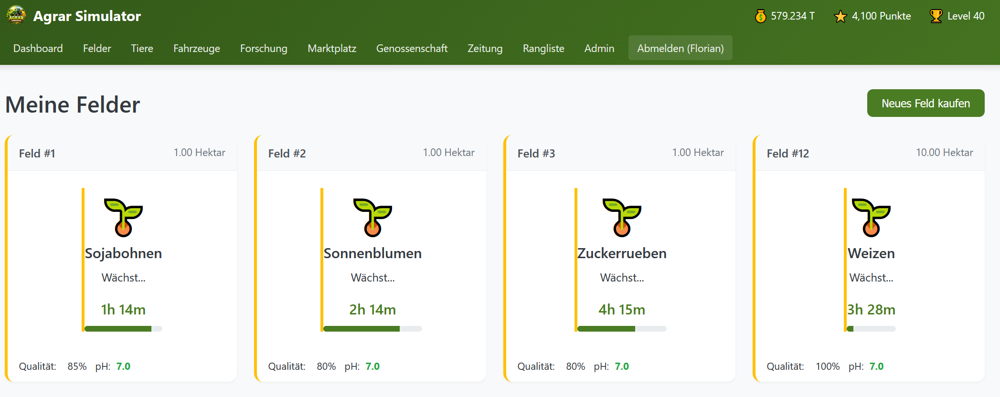
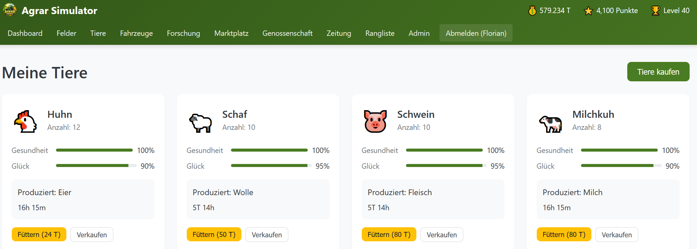
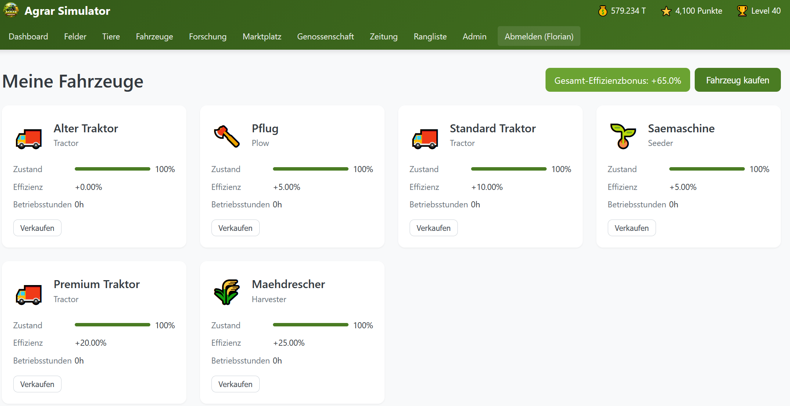
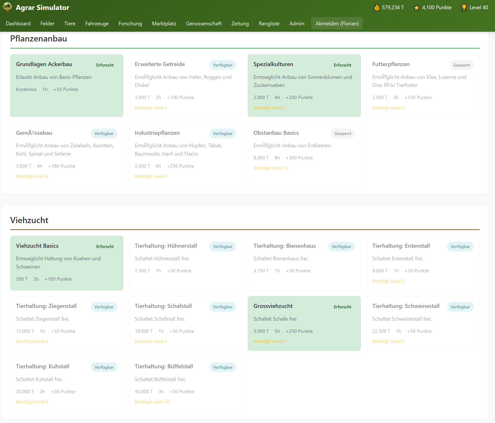
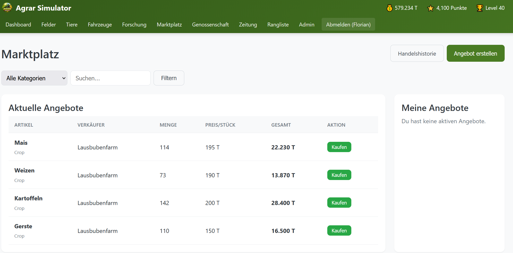
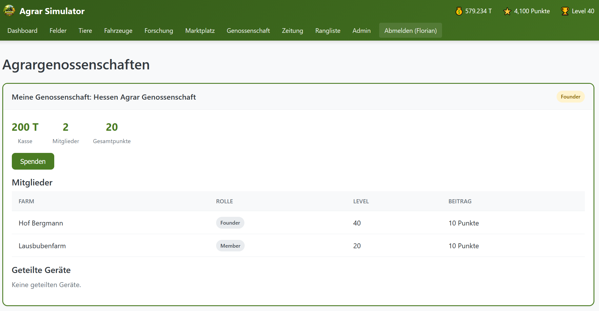
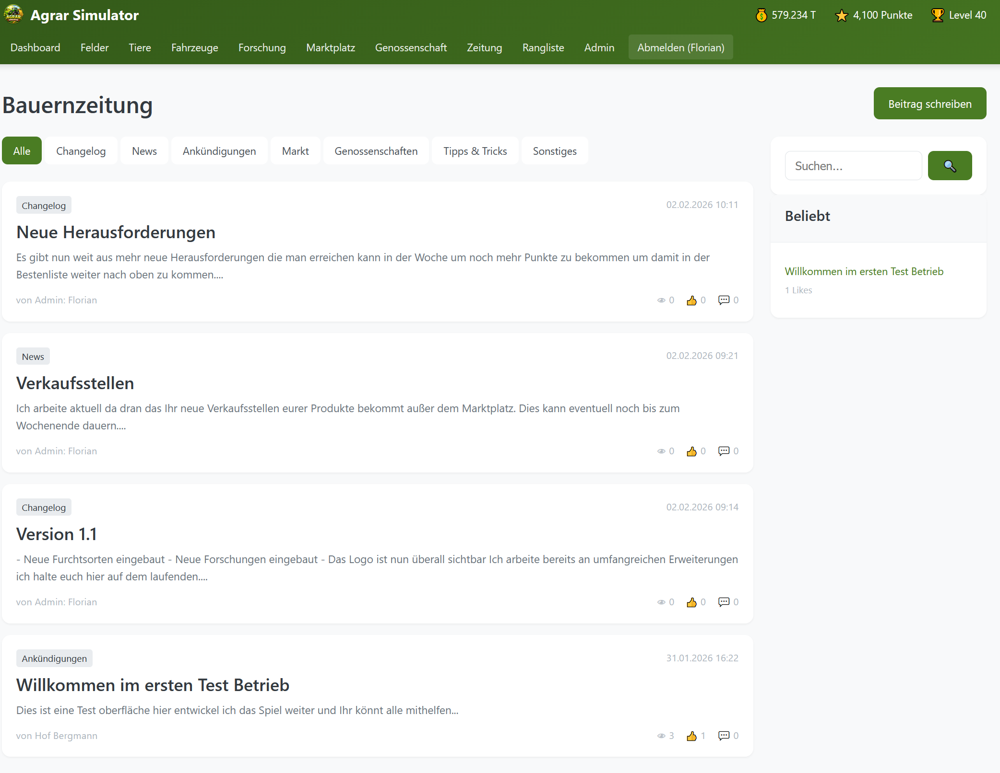
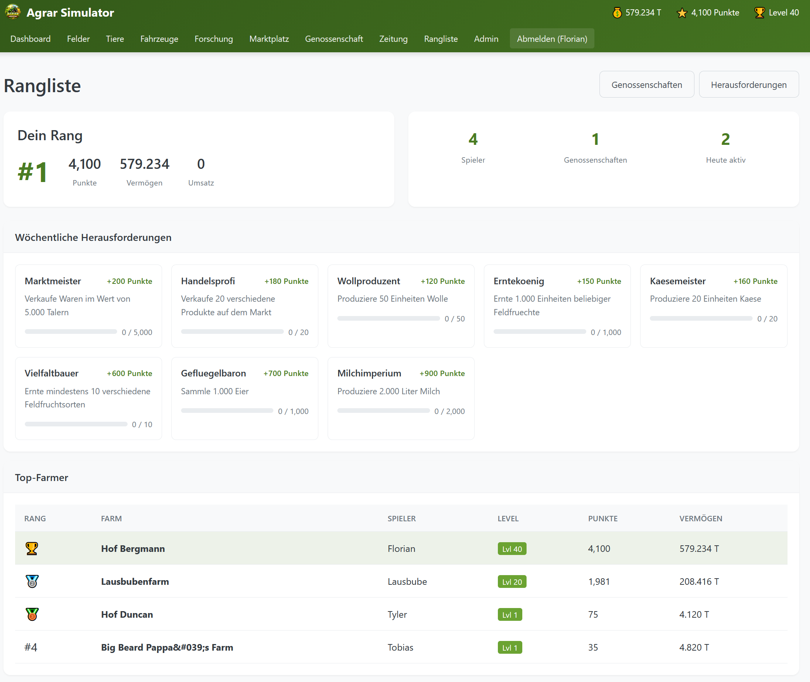
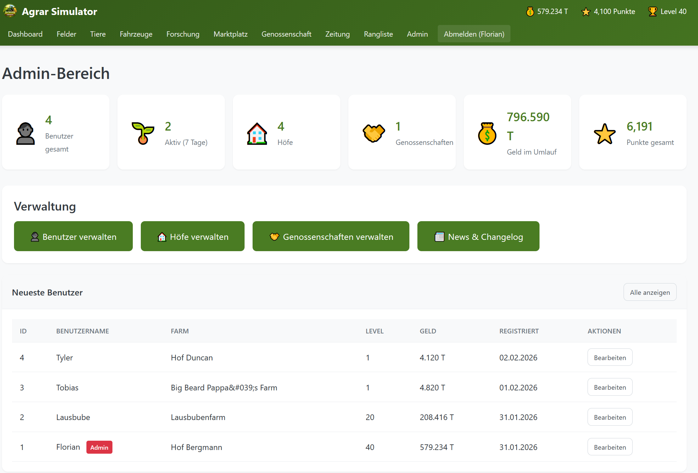

# Agrar Simulator

Ein umfangreiches Browser-basiertes Landwirtschafts-Simulationsspiel, entwickelt mit PHP 8 und MySQL.


[](https://discord.com/invite/S53gZ6Rg9C)

## Screenshots

### Dashboard


### Felder bewirtschaften


### Tierhaltung


### Fahrzeugpark


### Forschung & Technologie


### Marktplatz


### Genossenschaften


### Zeitung & News


### Rangliste


### Admin-Bereich


---

## Features

### Farming & Produktion
- **Felder bewirtschaften** - Kaufe Felder, pflanze verschiedene Feldfrüchte und ernte sie
- **Bodenqualität** - Düngen und Kalken verbessert die Erträge
- **Tiere halten** - Kühe, Schweine, Hühner, Schafe, Büffel und mehr
- **Tierprodukte** - Milch, Eier, Wolle, Fleisch und verarbeitete Produkte
- **Fahrzeuge nutzen** - Traktoren, Mähdrescher und Transportfahrzeuge

### Produktionssystem
- **71+ Produktionsstätten** - Von Bäckerei bis Zuckerfabrik
- **333 Produkte** - Rohstoffe, Zwischenprodukte und Endprodukte
- **Produktionsketten** - Komplexe Abhängigkeiten zwischen Produktionen
- **10 Verkaufsstellen** - Spezialisierte Abnehmer für verschiedene Produktkategorien
- **5 Händler** - Landhandel, Bauernmarkt, Technik-Partner, Großhandel, Bio-Laden
- **8 Tierhaltungs-Gebäude** - Hühnerstall, Kuhstall, Schweinestall, Büffelstall, etc.

### Infrastruktur & Ressourcen
- **Wasserversorgung** - Brunnen (klein) und Wasserwerk (groß)
- **Stromproduktion** - Solaranlage, Windkraftanlage und Kraftwerk
- **Ressourcen-Management** - Wasser und Strom für Produktionen benötigt

### Wirtschaft & Handel
- **Marktplatz** - Handel mit anderen Spielern in Echtzeit
- **Verkaufsstellen** - 10 spezialisierte Abnehmer mit täglichen Preisen
- **Einkauf/Shop** - 5 Händler mit unterschiedlichen Produktsortimenten
- **Dynamische Preise** - Tagesbasierte Preisschwankungen bei Kauf und Verkauf
- **Preisvergleich** - Finde den besten Preis für deine Produkte
- **Lager-System** - Verwalte deine Ernte- und Produktionsprodukte

### Forschung & Fortschritt
- **Forschungsbaum** - Schalte neue Technologien und Boni frei
- **Level-System** - Sammle Punkte und steige im Level auf
- **Täglicher Login-Bonus** - Belohnungen für regelmäßiges Spielen
- **Erfahrungspunkte** - Verdiene XP durch alle Aktivitäten

### Community
- **Genossenschaften** - Gründe oder tritt einer Genossenschaft bei
- **Ausrüstung teilen** - Verleihe Fahrzeuge an Genossenschaftsmitglieder
- **Zeitung & Forum** - Diskutiere mit anderen Spielern
- **Discord-Integration** - Community-Server für direkten Austausch

### Wettbewerb
- **Ranglisten** - Globale Spieler- und Genossenschafts-Rankings
- **Top-Listen** - Nach Punkten, Level, Geld und mehr
- **Wöchentliche Herausforderungen** - Spezielle Aufgaben mit Bonuspunkten

### Administration
- **Admin-Panel** - Vollständige Verwaltung von Benutzern, Höfen und Genossenschaften
- **Benutzer bearbeiten** - Name, E-Mail, Passwort, Geld, Punkte, Level
- **Manuelle Verifizierung** - Admins können Benutzer direkt verifizieren
- **Bug-Report-System** - Spieler können Bugs melden, Admins verwalten mit Discord-Integration
- **News & Changelog** - Admin-Beiträge mit automatischer Discord-Benachrichtigung
- **Spielregeln** - Verhaltensregeln und Community-Richtlinien

### Discord Integration
- **Webhook-Benachrichtigungen** - Automatische Posts bei News und Changelog-Einträgen
- **Bug-Reports** - Automatische Forum-Threads für gemeldete Bugs
- **Status-Updates** - Admin-Begründungen werden an Discord gesendet
- **Konfigurierbar** - Ein-/Ausschaltbar in der config.php

## Währung

Das Spiel verwendet eine eigene Währung: **Agrar Taler (T)**

## Technologie-Stack

- **Backend:** PHP 8.x mit MVC-Architektur
- **Datenbank:** MySQL/MariaDB mit UTF-8 Unterstützung
- **Frontend:** HTML5, CSS3, Vanilla JavaScript
- **Sicherheit:** CSRF-Schutz, bcrypt Passwort-Hashing, Prepared Statements
- **Dark Mode:** Vollständig unterstützt

## Installation

### Voraussetzungen

- PHP 8.0 oder höher
- MySQL 5.7 / MariaDB 10.3 oder höher
- Apache mit mod_rewrite oder Nginx
- cURL Extension für PHP (für Discord-Integration)

### Schnellstart

1. **Repository klonen:**
```bash
git clone https://github.com/dein-username/lsbg-agrar-simulator.git
cd lsbg-agrar-simulator
```

2. **Datenbank erstellen:**
```sql
CREATE DATABASE agrar_simulator CHARACTER SET utf8mb4 COLLATE utf8mb4_unicode_ci;
CREATE USER 'agrar_user'@'localhost' IDENTIFIED BY 'dein_sicheres_passwort';
GRANT ALL PRIVILEGES ON agrar_simulator.* TO 'agrar_user'@'localhost';
FLUSH PRIVILEGES;
```

3. **Schema importieren:**
```bash
mysql -u agrar_user -p agrar_simulator < sql/install.sql
```

4. **Produktionssystem importieren:**
```bash
mysql -u agrar_user -p agrar_simulator < sql/productions_migration.sql
```

5. **Bug-Report-System einrichten:**
```bash
mysql -u agrar_user -p agrar_simulator < sql/bug_reports_migration.sql
mysql -u agrar_user -p agrar_simulator < sql/bug_reports_discord_update.sql
```

6. **Shop/Einkauf-System einrichten:**
```bash
mysql -u agrar_user -p agrar_simulator < sql/shop_migration.sql
```

7. **Wasser- und Stromproduktion einrichten:**
```bash
mysql -u agrar_user -p agrar_simulator < sql/water_electricity_migration.sql
mysql -u agrar_user -p agrar_simulator < sql/energy_water_expansion.sql
```

6. **Admin-Benutzer erstellen:**
Nach der Registrierung im Spiel:
```sql
UPDATE users SET is_admin = TRUE WHERE username = 'dein_benutzername';
```

7. **Konfiguration anpassen:**

Bearbeite `config/database.php`:
```php
return [
    'host'     => 'localhost',
    'database' => 'agrar_simulator',
    'username' => 'agrar_user',
    'password' => 'dein_sicheres_passwort',
    'charset'  => 'utf8mb4',
];
```

Bearbeite `config/config.php`:
```php
define('BASE_URL', '');  // Leer lassen wenn im Root
define('DEBUG_MODE', false);  // In Produktion auf false

// Discord Webhook (optional)
define('DISCORD_WEBHOOK_URL', 'https://discord.com/api/webhooks/DEINE_ID/DEIN_TOKEN');
define('DISCORD_WEBHOOK_ENABLED', true);
```

8. **Webserver konfigurieren:**

**Apache:** Setze das Document Root auf den `public/` Ordner.

**Nginx:**
```nginx
server {
    root /var/www/agrar-simulator/public;
    index index.php;

    location / {
        try_files $uri $uri/ /index.php?$query_string;
    }

    location ~ \.php$ {
        fastcgi_pass unix:/var/run/php/php8.0-fpm.sock;
        fastcgi_param SCRIPT_FILENAME $realpath_root$fastcgi_script_name;
        include fastcgi_params;
    }
}
```

9. **Cron Jobs einrichten:**
```cron
*/5 * * * * php /var/www/agrar-simulator/cron/harvest_check.php
*/5 * * * * php /var/www/agrar-simulator/cron/research_check.php
0 */6 * * * php /var/www/agrar-simulator/cron/animal_check.php
0 * * * * php /var/www/agrar-simulator/cron/rankings_update.php
```

## Projektstruktur

```
lsbg-agrar-simulator/
├── app/
│   ├── controllers/     # Controller-Klassen
│   ├── core/            # Kernklassen (Database, Router, Session, DiscordWebhook)
│   ├── models/          # Model-Klassen
│   └── views/           # PHP-Templates
├── config/
│   ├── config.php       # Hauptkonfiguration (inkl. Discord Webhook)
│   └── database.php     # Datenbankverbindung
├── cron/                # Cron-Job-Skripte
├── logs/                # Log-Dateien
├── public/              # Document Root
│   ├── css/             # Stylesheets
│   ├── js/              # JavaScript
│   ├── img/             # Bilder & Screenshots
│   └── index.php        # Entry Point
├── scripts/             # Hilfsskripte
│   ├── parse_productions.py   # Produktionsdaten-Parser
│   └── fix_umlauts.py         # Umlaut-Korrektur für SQL
└── sql/
    ├── install.sql                    # Basis-Datenbank-Schema
    ├── productions_migration.sql      # Produktionssystem-Migration
    ├── bug_reports_migration.sql      # Bug-Report-System
    ├── bug_reports_discord_update.sql # Discord-Integration für Bug-Reports
    ├── shop_migration.sql             # Shop/Einkauf-System
    ├── water_electricity_migration.sql # Wasserwerk & Kraftwerk
    ├── energy_water_expansion.sql     # Brunnen, Solar, Wind
    ├── fix_all_umlauts.sql            # Umlaut-Korrektur für alle Tabellen
    └── fix_challenge_umlauts.sql      # Umlaut-Korrektur für Challenges
```

## API-Endpunkte

Das Spiel bietet eine REST-API für AJAX-Interaktionen:

| Endpunkt | Methode | Beschreibung |
|----------|---------|--------------|
| `/api/farm/stats` | GET | Farm-Statistiken |
| `/api/farm/fields` | GET | Alle Felder |
| `/api/field/plant` | POST | Feld bepflanzen |
| `/api/field/harvest` | POST | Feld ernten |
| `/api/market/listings` | GET | Marktangebote |
| `/api/research/tree` | GET | Forschungsbaum |

## Sicherheit

- **CSRF-Token:** Alle Formulare sind mit CSRF-Tokens geschützt
- **Prepared Statements:** Schutz vor SQL-Injection
- **Password Hashing:** bcrypt mit Kostenfaktor 12
- **Input Validation:** Serverseitige Validierung aller Eingaben
- **XSS-Schutz:** HTML-Escaping aller Ausgaben

## Community

[](https://discord.com/invite/S53gZ6Rg9C)

Tritt unserer Discord-Community bei für:
- Direkten Support
- Feature-Vorschläge
- Bug-Reports und Feedback
- Austausch mit anderen Spielern

## Mitwirken

Beiträge sind willkommen! Bitte erstelle einen Fork und reiche einen Pull Request ein.

1. Fork das Repository
2. Erstelle einen Feature-Branch (`git checkout -b feature/NeuesFeature`)
3. Committe deine Änderungen (`git commit -m 'Neues Feature hinzugefügt'`)
4. Push zum Branch (`git push origin feature/NeuesFeature`)
5. Erstelle einen Pull Request

## Lizenz

Dieses Projekt ist unter der MIT-Lizenz lizenziert. Siehe [LICENSE](LICENSE) für Details.

## Autor

Entwickelt mit [Claude Code](https://claude.ai/code)

---

**Live Demo:** [agrar.sl-wide.de](https://agrar.sl-wide.de)
